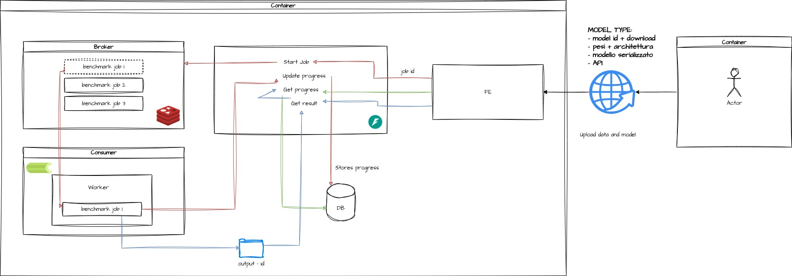
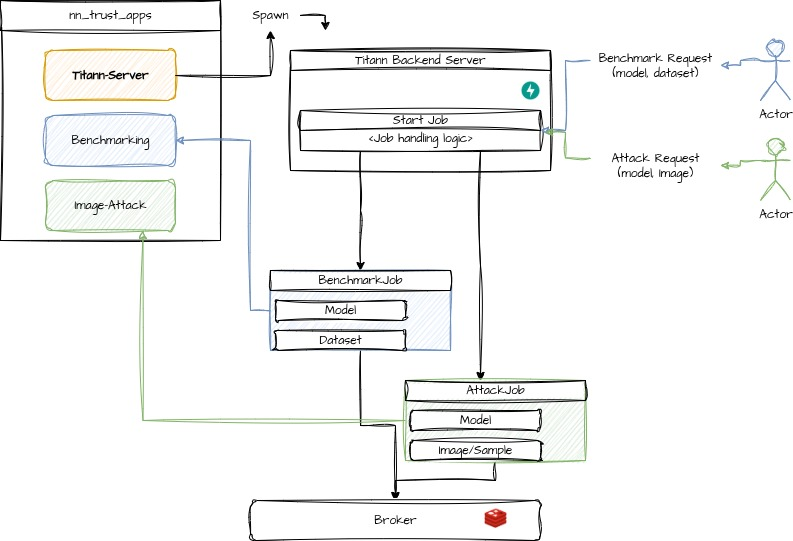

# Getting started

## Install dependencies
Positioned at project top level directory `attack-server`

### Python

Run `uv pip sync`

### Javascript & Co

RUN `cd submodules && npm install`

## Start required services and setup folders
Positioned at project top level directory `attack-server`

1. Start redis for example with docker `docker run -p 6379:6379 redis`
2. Start FastAPI application server `python app.py`
3. Start Celery Worker `celery -A celery_worker.celery --workdir ./celery worker`
4. Start Celery with flower for job monitoring dashboard `celery -A celery_worker.celery --workdir ./celery flower`
5. Create `data-quality-gui` required dataset and model folders (if they dont already exists) `mkdir -p submodules/data-quality_gui/public/titann/datasets` and `mkdir -p submodules/data-quality_gui/public/titann/models`
6. Start frontend `cd submodules/data-quality_gui && npm run dev`

# How it Works

## Titann Backend Server

This framework has the goal of  
1. Accepting requests from a FrontEnd application, at present focus is on `Benchmark` or `Attack`
2. Validate, Schedule, Run and Monitor jobs stemming from the incoming requests.
3. Save and persist completed jobs
4. Provide an API to query job status, and job results for the FrontEnd application.

## Server App Ecosystem

The Titann Backend Fastapi Server act as a single endpoint to manage incoming requests.
Each request may need specific functionalities depending from `nn_trust` (core attack library) or any of the of the other `titann apps` namely `benchmarking` and `image-attack`.

The Titann server can be isolated from the logic of the apps, and just import them as submodules providing app-specific functionalities.

